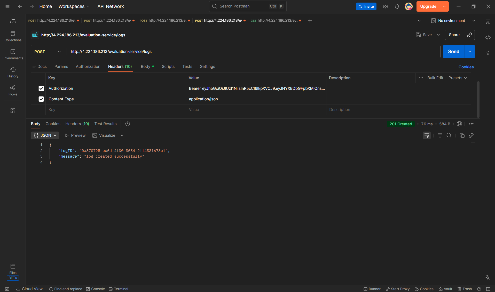

# Campus Notification Platform

This is a full stack project I built for a campus notification system. The idea is simple - students should be able to see notifications about placements, college events, and exam results in one place.

I split the project into three main parts. First I built a logging middleware that records what is happening inside the app. Then I wrote a design document that covers how the system should work, what database to use, and how to handle performance issues. Finally I built the frontend using React so students can actually see and interact with the notifications.

## What is inside this repo

The logging-middleware folder has the Log function which I use throughout the project to track events. Instead of using console.log I call this function and it sends the log to a server.

The notification-system-design.md file has my answers to all the design questions. It covers the API structure, database design, query optimization, caching strategy, and bulk notification handling.

The priority-inbox.js file is a script that takes a list of notifications and returns the most important ones first. Placement notifications rank highest, then Results, then Events. Newer ones also rank higher.

The notification-app-fe folder has the React app that students use to view their notifications.

## How to run the frontend

```
cd notification-app-fe
npm install
npm run dev
```

Open http://localhost:3000 in your browser.

## Screenshots

### Notifications page on desktop


### Filtering by Placement


### Priority Inbox on desktop


### Notifications page on mobile


### Priority Inbox on mobile


### Getting the auth token from API


### Fetching notifications from API


### Testing the logging middleware


