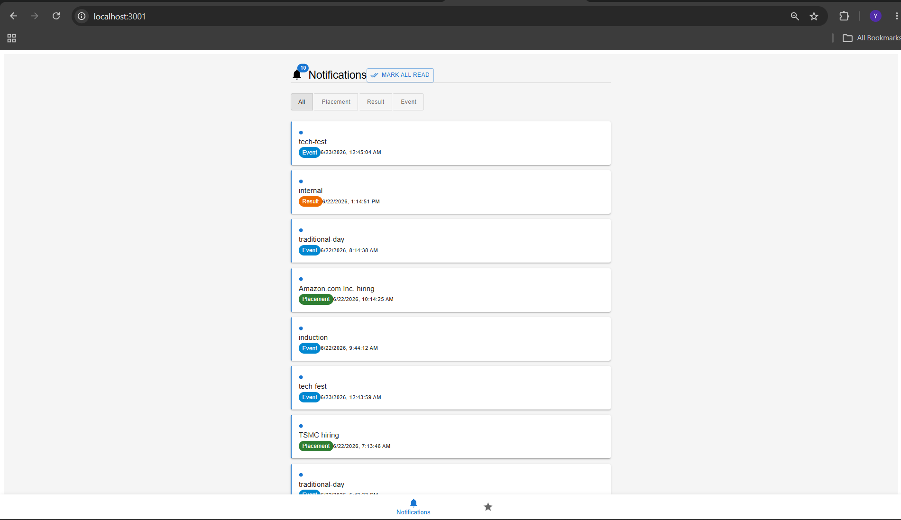
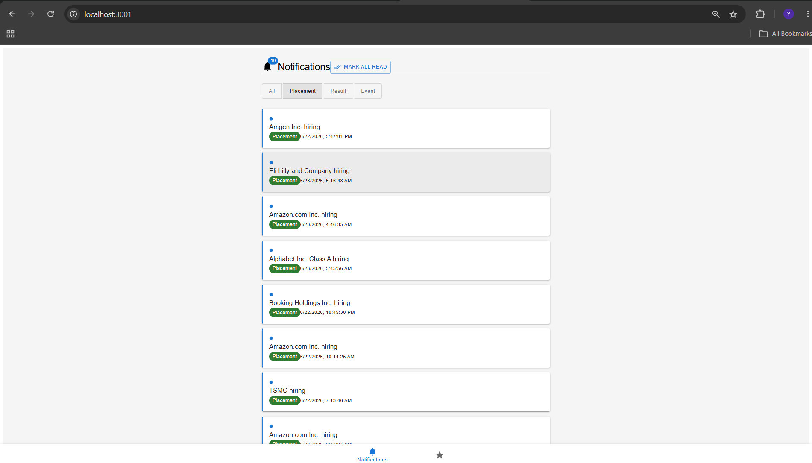
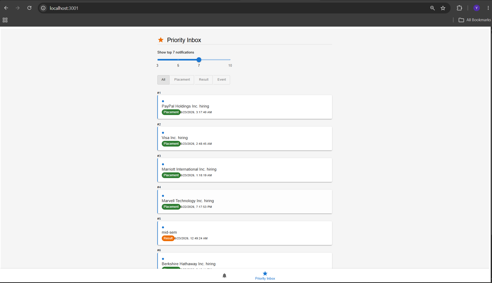
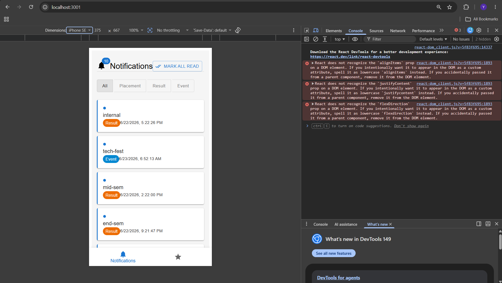
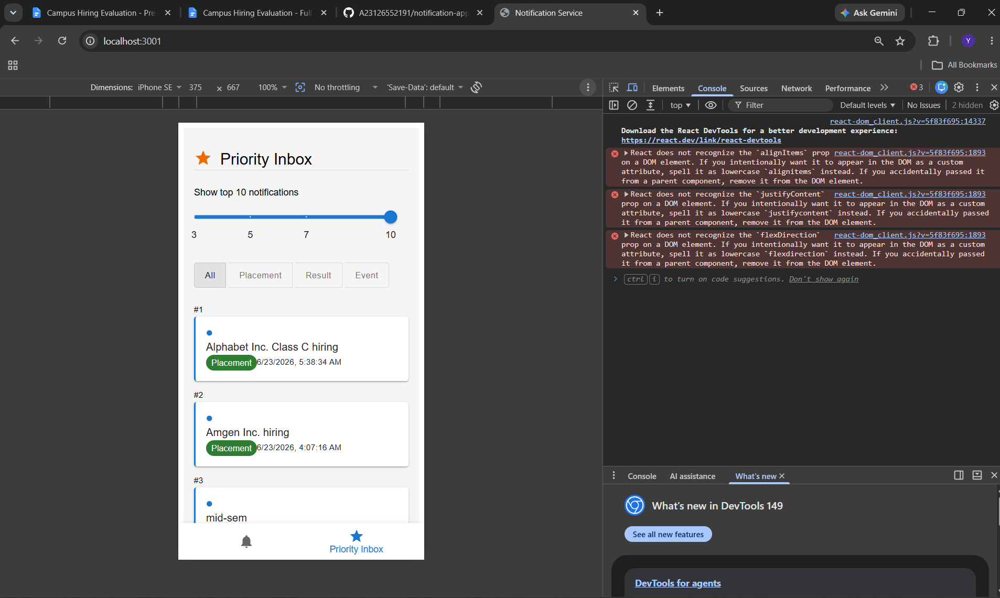
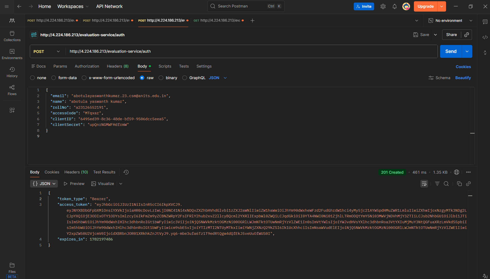
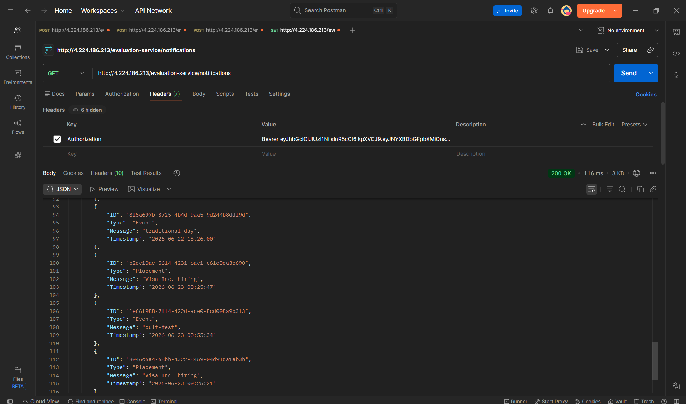

# Campus Notification Platform

A full stack campus notification system where students receive updates about placements, events, and results.

The project is organized into three parts: a reusable logging middleware, a system design document covering architecture and database decisions, and a React frontend application.

## Project Structure

- logging-middleware — reusable Log() function that sends logs to the evaluation server
- notification-system-design.md — system design covering API design, database schema, query optimization, caching, and bulk notification handling
- priority-inbox.js — standalone script that ranks notifications by type weight and recency
- notification-app-fe — React frontend with notifications listing and priority inbox

## Setup

Install and run the frontend:

```
cd notification-app-fe
npm install
npm run dev
```

The app runs on http://localhost:3000

## Output Screenshots

### Notifications Page - Desktop



### Notifications Page - Placement Filter



### Priority Inbox - Desktop



### Notifications Page - Mobile View



### Priority Inbox - Mobile View



### API - Auth Token



### API - Notifications Response


